# Installing Graylog Forwarder

---
🗒️ **NOTE**

The following steps must be completed on a linux server. This can be a virtual server but it must be linux.

---

## Introduction

This page will provide instructions for how to install the Graylog Forwarder. For more information about the Graylog Forwarder, see [Forwarder](https://go2docs.graylog.org/5-0/getting_in_log_data/forwarder.html) via our docs site.

## Prerequisites

* A linux server
    * These instructions will cover installing on Ubuntu Server 20.04 LTS
* The ability to "ssh" into the server

## Install

Housekeeping:

The code block below can be copy/pasted into a terminal.

```
sudo apt update && sudo apt upgrade

```

Download and Install:

The code block below can be copy/pasted into a terminal.

```
sudo apt-get install -y apt-transport-https openjdk-17-jdk-headless
wget https://packages.graylog2.org/repo/packages/graylog-forwarder-repository_5-1_all.deb
sudo dpkg -i graylog-forwarder-repository_5-1_all.deb
sudo apt-get update
sudo apt-get install -y graylog-forwarder

```

## Setup Forwarder via Graylog Cloud

1. Login to your Graylog Cloud instance
2. Using the top menu, Click **System** and then click **Forarders**<br>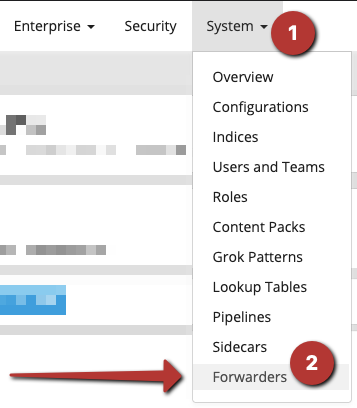
3. Click "**Get Started!**"<br>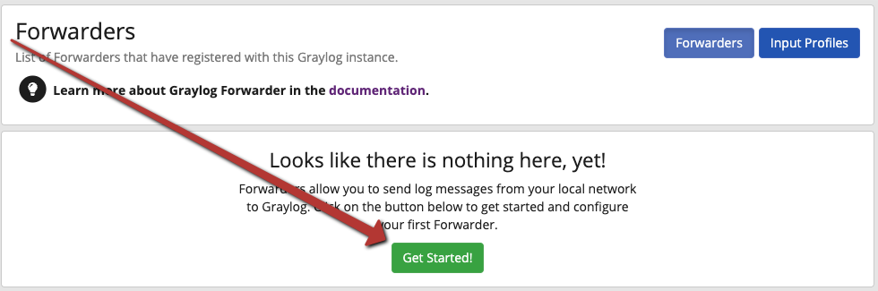

### Complete 'New Forwarder' steps
1. **Start Configuration**<br>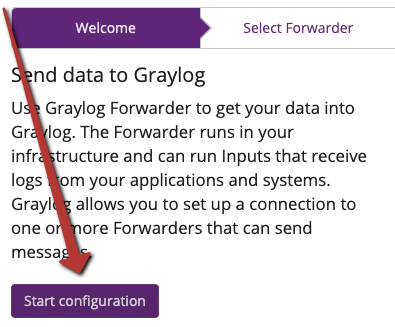
2. **Start new Forwarder**<br>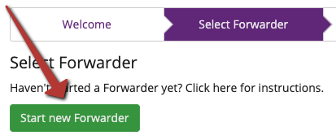
3. Because we've completed the 'Install Forwarder' step in the above section, click **Continue**<br>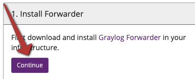
4. Input token name: `forwarder`, then click **Create Token**<br>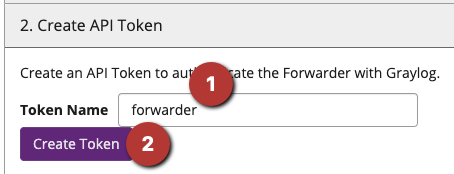
5. Click **Copy as configuration snippet**<br>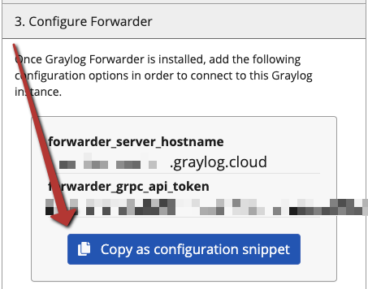
6. Using SSH edit the Graylog Forwarder configuration file to add the snippet we copied in the above step:
    1. SSH to your linux server where you install the Graylog Forwarder
    2. Edit the forwarder configuration file:
        * `sudo nano /etc/graylog/forwarder/forwarder.conf`
    3. You should see the following on the first 2 lines. Delete these first 2 lines using the delete and/or backspace keys:<br>`forwarder_server_hostname =`<br>`forwarder_grpc_api_token =`
    4. Paste the snippet (ctrl+v) copied in the above step. The end result should look like this:<br>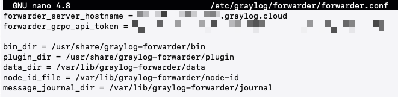
    5. While the SSH/terminal window is active/selected, press Ctrl+X to save and exit. You will be asked to "Save modified buffer?" Press Y to save and then press Enter to confirm.<br>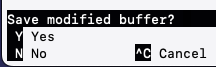

7. Using the SSH, start and enable the Graylog Forwarder:

```
sudo systemctl enable graylog-forwarder
sudo systemctl start graylog-forwarder

```

8. Back to the Graylog Console where we were setting up the new forwarder, Click **Continue**<br>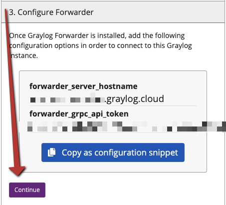
9. You should see the forwarder appear beneath the 'Select Forwarder' section. Click the forwarder to select it and then click **Configure selected Fowarder**<br>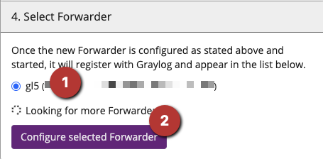
10. Click 'Add Forwarder Inputs'<br>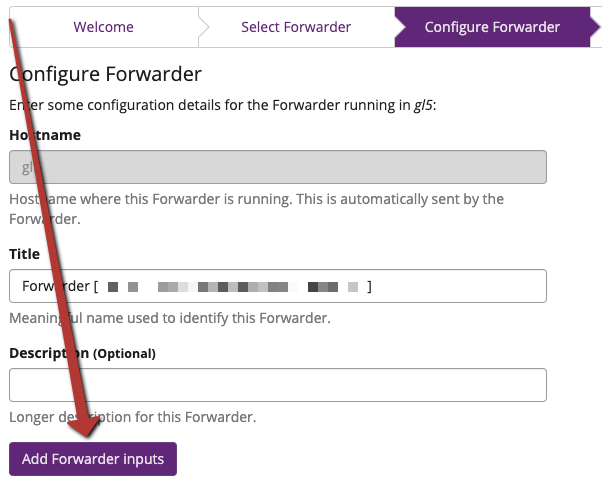
11. Click **Create Input Profile**<br>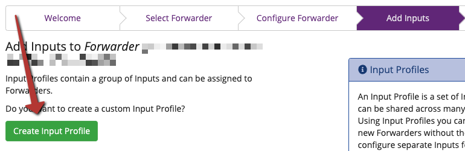
12. Input title "Forwarder" and click **Add Inputs**<br>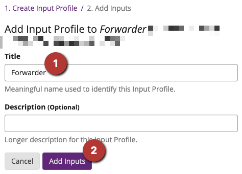

### Add Syslog UDP Input

Before continuing, use SSH to add the following IP Tables rules to the linux server where the Graylog Forwarder is installed.

This allows devices to send syslog to the Graylog Forwarder on the default syslog port, 514. However, the Graylog Syslog input will listen on port 1514.

```
sudo iptables -t nat -A PREROUTING -p tcp --dport 514 -j REDIRECT --to 1514
sudo iptables -t nat -A PREROUTING -p udp --dport 514 -j REDIRECT --to 1514

```

Back to the Graylog Cloud webpage:

1. Input Type: Syslog UDP
2. Title: Syslog UDP
3. Bind Address: (leave default) 0.0.0.0
4. Port: 1514
5. **Create Input**

### Add Syslog TCP Input

1. **Add another input**<br>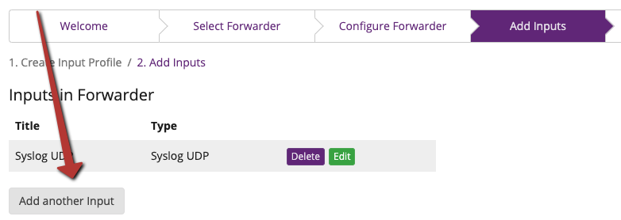
2. Input Type: Syslog TCP
3. Title: Syslog TCP
4. Bind Address: (leave default) 0.0.0.0
5. Port: 1514
6. **Create Input**

### Add Beats Input

1. **Add another input**<br>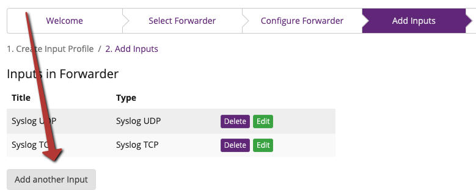
2. Input Type: Beats
3. Title: Beats
4. Bind Address: (leave default) 0.0.0.0
5. Port: (leave default) 5044
6. **Create Input**

### Save Inputs and complete New Forwarder setup

1. Click **Save Inputs**<br>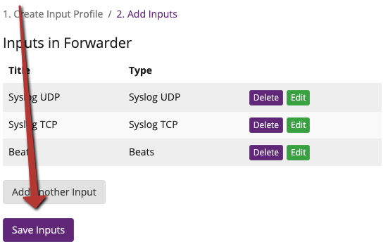
2. Click **Exit configuration**<br>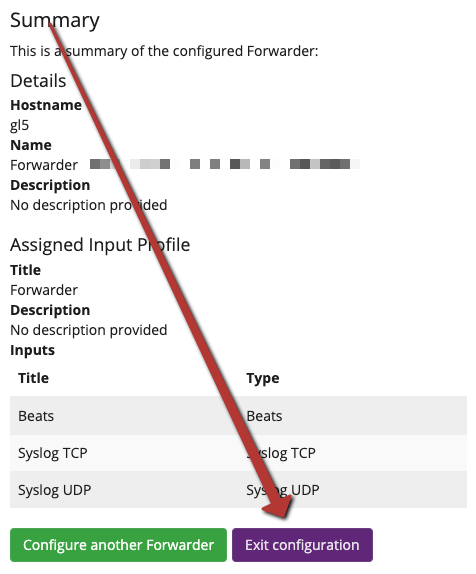

## Conclusion

Congrats, You now have a functional Graylog Forwarder!

Your forwarder should appear on the System/Forwarders page and should show 'Status: Connected'<br>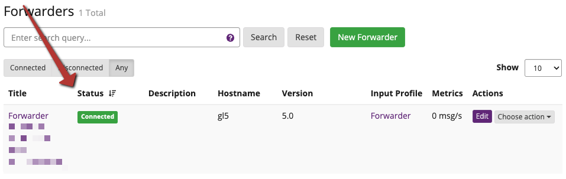

You can now configure log sources to send log messages to this forwarder using the inputs you created in the above steps. All logs sent to the Graylog Forwarder will be encrypted with TLS encryption and sent to your Graylog Cloud instance for processing and ingestion.


