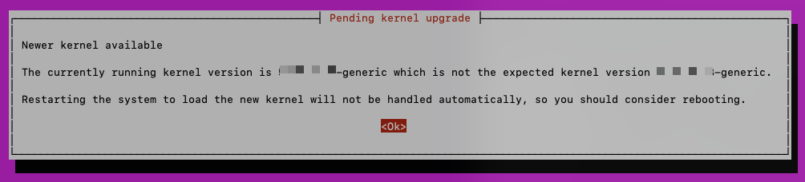

# Installing MongoDB

---
🗒️ **NOTE**

The following steps are completed on the server/instance that will be used for MongoDB/Graylog. This instance will ONLY have MongoDB/Graylog installed.

---

## Introduction

This page will provide instructions for how to install MongoDB on Ubuntu **22**.04 LTS.

Server Recommendations:

| Server Role       | CPU Cores | RAM  |
| ----------------- | --------- | ---- |
| Graylog/MongoDB   | 8         | 16GB |

Code blocks below can be copy/pasted into a terminal.

## Housekeeping

Authenticate with sudo at least 1 time to ensure code blocks that have multiple lines with sudo commands run correctly:

```sh
sudo whoami

```

Upgrade existing packages to latest versions. Ensure we start from a clean and updated state.

```sh
# Housekeeping, Upgrade/update all existing Ubuntu Server packages
sudo apt update && sudo apt upgrade -y
```

During `apt upgrade` you may be presented with a screen that looks like this:



1. Press Enter `<Ok>`
2. You will then be presented with a screen that lists some services.
    * 
3. Leave the defaults, press Tab to select `<Ok>` and then press Enter.

After this is complete, reboot the server to ensure all upgrades/updates are fully applied:

```sh
sudo shutdown -r now

```

After reboot, continue with these commands:

```sh
# set timezone to UTC
sudo timedatectl set-timezone UTC

# disable cloud-init, not needed for our purposes
sudo touch /etc/cloud/cloud-init.disabled

```

## Install

Install MongoDB

```sh
# for reference, via https://www.mongodb.com/docs/manual/tutorial/install-mongodb-on-ubuntu/
# Install MongoDB 6

# Prevent startup error: vm.max_map_count is too low
sudo sysctl -w vm.max_map_count=262144
echo 'vm.max_map_count=262144' | sudo tee -a /etc/sysctl.conf

curl -fsSL https://www.mongodb.org/static/pgp/server-6.0.asc | \
   sudo gpg -o /usr/share/keyrings/mongodb-server-6.0.gpg \
   --dearmor
echo "deb [ arch=amd64,arm64 signed-by=/usr/share/keyrings/mongodb-server-6.0.gpg ] https://repo.mongodb.org/apt/ubuntu jammy/mongodb-org/6.0 multiverse" | sudo tee /etc/apt/sources.list.d/mongodb-org-6.0.list
sudo apt update
sudo apt install -y mongodb-org mongodb-mongosh

```

Enable and Start MongoDB

```
# Enable MongoDB service
sudo systemctl daemon-reload
sudo systemctl enable mongod.service
sudo systemctl start mongod.service

```

## Verify Completion

```sh
mongosh --eval "db.version()" --quiet

```

Should return something like:

```
6.0.9
```
