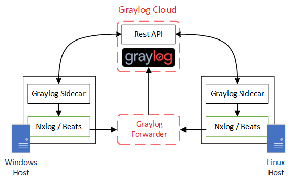
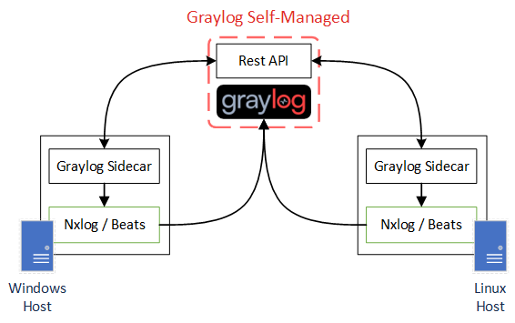
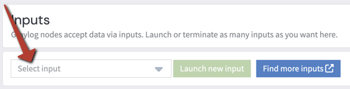
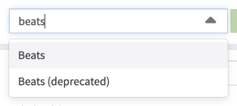
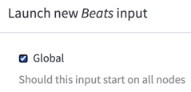
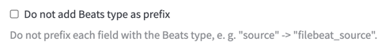

# Installing Graylog Sidecar

## Introduction

This page will provide instructions for how to install [Graylog Sidecar](https://docs.graylog.org/docs/sidecar).

Sidecar is used to collect logs from devices, and is installed on any endpoint you wish to collect logs from.

Graylog sidecar communicates with its graylog cluster using the graylog API. This applies to both self managed (on premises) and Graylog Cloud clusters.

However, for Graylog cloud, the sidecar will send logs to the Graylog Forwarder instead of the Graylog Cluster itself.

Graylog Cloud:<br>

Graylog Self-Managed:<br>

## Prerequisites

### API Token
Before you can use Sidecar, you must first generate an API token that Sidecar can use to securely communicate with your graylog cluster.

Via your Graylog Web Interface:

1. Navigate to System / **Sidecars**
2. Follow the link for "Create or reuse a token for the *graylog-sidecar* user" 
3. **Create** a token:
    1. Input token name
    2. Create Token
    * 
    * NOTE: This token is only viewable on this page one time. Make sure to save this token somewhere that you can reference it in the future, such as a password manager. You can reuse this token for all of your sidecar installs.

### Beats Input

Make sure you have a beats input created and started before continuing.

Via your Graylog Web Interface:

1. Navigate to System / **Inputs**
2. Click on the **Select input** select box<br>
3. Type **beats** and select beats from the select menu<br>
4. Click **Launch new input**<br>
5. Configure input:
    * Check checkbox for **Global**. This will configure the input to run on ALL Graylog nodes.<br>
    * Input a title. This title can be anything. For example "Beats"
    * Make sure you leave "Do not add Beats type as prefix" in its default, unchecked state<br>
    * Click **Launch Input**

# Install - Windows

Install Sidecar on any device(s) you want to collect logs from and forward to your graylog cluster.

## Download

Download the latest release via https://github.com/Graylog2/collector-sidecar/releases/latest .

For Microsoft Windows (Both Windows and Windows Server) download graylog_sidecar_installer_[version].exe.

## Install


Sidecar can be installed by executing the download file, such as the `.exe`. You will be prompted to input your Graylog API address and your API key.

Your graylog API will be the same URL as your graylog cluster, followed by `/api`.

For example: if your graylog server is at `192.168.0.2:9000`, your api url would be `http://192.168.0.2:9000/api`

---
🗒️ **NOTE**

Note in the above example we're using http instead of HTTPS. If you have configured graylog to use TLS, you can use HTTPS instead.

---

For our published documentation, see https://go2docs.graylog.org/5-2/getting_in_log_data/graylog_sidecar.html#InstallationbyOS

### Silent/Automated Install

You can also install Graylog Sidecar silently and/or an automated installation method, such as an Endpoint Management system that can distribute and install software remotely on endpoints.

Example install script:

NOTE: update `graylog_sidecar_installer.exe` with the name of the downloaded sidecar installer file.

NOTE: update the `SERVERURL` and `APITOKEN` arguments with the values applicable to your install and environment.

```
"graylog_sidecar_installer.exe" /S -SERVERURL=https://GRAYLOGSERVER.DOMAIN.COM/api -APITOKEN=YOURAPITOKEN
```

You can also specify tags when installing, using the `-TAGS=` argument:

```
"graylog_sidecar_installer.exe" /S -SERVERURL=https://GRAYLOGSERVER.DOMAIN.COM/api -APITOKEN=YOURAPITOKEN -TAGS=["example","IIS"]
```

# Install - Linux

Install Sidecar on any device(s) you want to collect logs from and forward to your graylog cluster.

## Ubuntu Server

Code blocks below can be copy/pasted into a terminal.

Download/install Graylog Sidecar:

```
wget https://packages.graylog2.org/repo/packages/graylog-sidecar-repository_1-5_all.deb && sudo dpkg -i graylog-sidecar-repository_1-5_all.deb && sudo apt-get update && sudo apt-get install graylog-sidecar
```

Download/install [filebeat](https://www.elastic.co/beats/filebeat) and [auditbeat](https://www.elastic.co/beats/auditbeat):

```
wget -qO - https://artifacts.elastic.co/GPG-KEY-elasticsearch | sudo apt-key add - && echo "deb https://artifacts.elastic.co/packages/8.x/apt stable main" | sudo tee -a /etc/apt/sources.list.d/elastic-8.x.list && sudo apt-get update && sudo apt-get install filebeat auditbeat
```

---
🗒️ **NOTE**

Because Graylog Sidecar will manage the above collectors (e.g. filebeat, auditbeat), the services should be left in a disabled state. This is the default state, but noting here that you should not enable the services.

---

Set Graylog API URL:

```
echo -ne "Enter Graylog API\nExample: http://hostname.domain.tld:port/api/\nNOTE: must include trailing slash / at end\nAPI Url: " && tmp=$(head -1 </dev/stdin | sed -r 's/\//\\\//g') && sudo sed -i "s/.*server_url:.*/server_url: \"$tmp\"/g" /etc/graylog/sidecar/sidecar.yml
```

Set Graylog API Token:

```
echo -n "Enter Graylog API Token: " && tmp=$(head -1 </dev/stdin) && sudo sed -i "s/.*server_api_token:.*/server_api_token: \"$tmp\"/g" /etc/graylog/sidecar/sidecar.yml
```

Install, Enable and Start Graylog-Sidecar service:

```
sudo graylog-sidecar -service install
sudo systemctl enable graylog-sidecar
sudo systemctl start graylog-sidecar
```

