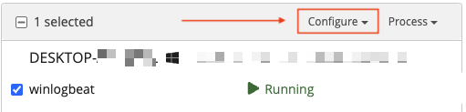

# Sidecar Configuration

## Introduction

This page will provide instructions for how to create a Graylog Sidecar configuration that uses the Winlogbeat collector.

## Prerequisites

* Graylog Sidecar installed on at least 1 endpoint

## Create Configuration

A Sidecar configuration allows you to configure a log collector on the remote device where Graylog Sidecar is installed and running.

A configuration comprises 2 main parts:

1. Collector
    * The type of collector. For example Winglogbeat on Windows
2. Configuration
    * Configuration text that is used to configure the collector

To Create a configuration:

1. Via your Graylog web console, navigate to `System/Sidecars`
2. Click on `Configuration` (Towards the top right of page)
3. Fill out fields:
    * Name - Name of collector configuration
    * Collector: `Winlogbeat on Windows`
    * Configuration - see below, copy and paste text
4. Click `Create` at bottom of page to save this configuration


### Sample Winlogbeat configuration to be used with Graylog Sidecar:

Note: if you don't have sysmon installed, you can remove line `- name: Microsoft-Windows-Sysmon/Operational`

```yaml
# Needed for Graylog
fields_under_root: true
fields.collector_node_id: ${sidecar.nodeName}
fields.gl2_source_collector: ${sidecar.nodeId}
output.logstash:
   hosts: ["graylog.domain.tld:5044"]
path:
  data: C:\Program Files\Graylog\sidecar\cache\winlogbeat\data
  logs: C:\Program Files\Graylog\sidecar\logs
tags:
 - windows
# A little less noisy
winlogbeat.event_logs:
  - name: Application
    level: critical, error, warning
    ignore_older: 48h
  - name: Security
    processors:
        - drop_event.when.not.or:
            - equals.event_id: 129
            - equals.event_id: 141
            - equals.event_id: 1102
            - equals.event_id: 4648
            - equals.event_id: 4657
            - equals.event_id: 4688
            - equals.event_id: 4697
            - equals.event_id: 4698
            - equals.event_id: 4720
            - equals.event_id: 4738
            - equals.event_id: 4767
            - equals.event_id: 4728
            - equals.event_id: 4732
            - equals.event_id: 4634
            - equals.event_id: 4735
            - equals.event_id: 4740
            - equals.event_id: 4756
            - equals.event_id: 5158
    level: critical, error, warning, information
    ignore_older: 48h
  - name: System
    processors:
        - drop_event.when.not.or:
            - equals.event_id: 129
            - equals.event_id: 1022
            - equals.event_id: 1033
            - equals.event_id: 1034
            - equals.event_id: 4624
            - equals.event_id: 4625
            - equals.event_id: 4633
            - equals.event_id: 4719
            - equals.event_id: 4738
            - equals.event_id: 7000
            - equals.event_id: 7022
            - equals.event_id: 7024
            - equals.event_id: 7031
            - equals.event_id: 7034-7036
            - equals.event_id: 7040
            - equals.event_id: 7045
    level: critical, error, warning
    ignore_older: 48h
  - name: Microsoft-Windows-Sysmon/Operational
  - name: Windows PowerShell
    event_id: 400, 403, 600, 800
  - name: Microsoft-Windows-PowerShell/Operational
    event_id: 4103, 4104, 4105, 4106
  - name: Microsoft-Windows-Windows Defender/Operational
```

## Assign Configuration to Sidecar

Now that you have a configuration created, you can assign it to a sidecar.

1. Via your Graylog web console, navigate to `System/Sidecars`
2. Click on `Administration` (Towards the top right of page)
3. On This page: find the sidecar you wish to assign your configuration to
    * Click the checkbox for winlogbeat
    * 
4. Click Configure
    * 
5. Click on the config you wish to assign (e.g. the one just created)
6. Click `Confirm` on the dialog box that appears

This will apply the configuration immediately and start the applicable collector on the remote machine.