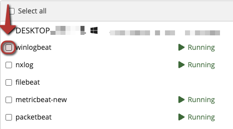

# Sidecar Configuration

## Introduction

This page will provide instructions for how to create a Graylog Sidecar configuration that uses the Winlogbeat collector.

## Prerequisites

* Graylog Sidecar installed on at least 1 endpoint

## Create Configuration

A Sidecar configuration allows you to configure a log collector on the remote device where Graylog Sidecar is installed and running.

A configuration comprises 2 main parts:

1. Collector
    * The type of collector. For example Winglogbeat on Windows
2. Configuration
    * Configuration text that is used to configure the collector

To Create a configuration:

1. Via your Graylog web console, navigate to `System/Sidecars`
2. Click on `Configuration` (Towards the top right of page)
3. Fill out fields:
    * Name - Name of collector configuration
    * Collector: `Winlogbeat on Windows`
    * Configuration - see below, copy and paste text
4. Click `Create` at bottom of page to save this configuration


### Sample Winlogbeat configuration to be used with Graylog Sidecar:

Note: if you don't have sysmon installed, you can remove line `- name: Microsoft-Windows-Sysmon/Operational`

```yaml
# Needed for Graylog
fields_under_root: true
fields.collector_node_id: ${sidecar.nodeName}
fields.gl2_source_collector: ${sidecar.nodeId}

# NOTE:
#   replace servername.domain.tld
#     with the name (or IP Address) of your graylog server.
# 
output.logstash:
   hosts: ["servername.domain.tld:5044"]
path:
  data: C:\Program Files\Graylog\sidecar\cache\winlogbeat\data
  logs: C:\Program Files\Graylog\sidecar\logs
tags:
 - windows

winlogbeat.event_logs:
  - name: Application
    level: critical, error, warning
    ignore_older: 48h

  # Account login: Successful, Failed, logged off, loggon using explicit credentials
  - name: Security
    event_id: 4616, 4624, 4625, 4634, 4647, 4648
    level: info
    ignore_older: 48h
    provider:
      - Microsoft-Windows-Security-Auditing

# Active Directory Monitoring: User account created, A user account was enabled, An attempt was made to change the password of an account, A user account was disabled,A user account was changed, A user account was locked out,A user account was unlocked
  - name: Security
    event_id:  4720-4727
    level: info
    ignore_older: 48h
    provider:
      - Microsoft-Windows-Security-Auditing

# Active directory Monitoring Group:A user was added to a privileged global group, 	A user was added to a privileged local group, A user was added to a privileged universal group, A privileged local group was modified, A privileged global group was modified, A privileged universal group was modified
  - name: Security
    event_id:   4728, 4729, 4730, 4731, 4732, 4733, 4734, 4735, 4737, 4738, 4740-4743, 4754-4758, 4764, 4767, 4769
    level: info
    ignore_older: 48h
    provider:
      - Microsoft-Windows-Security-Auditing

 # Active directory Kerberos:A Kerberos authentication ticket request failed
  - name: Security
    event_id:   4770-4773
    level: info
    ignore_older: 48h
    provider:
      - Microsoft-Windows-Security-Auditing
   
   # Active directory RDP: 
  - name: Security
    event_id:  1024, 1100, 1101, 1102, 1103, 1104, 1149, 98, 131, 21, 22, 25 
    level: info
    ignore_older: 48h
    provider:
      - Microsoft-Windows-Security-Auditing

  - name: System
    level: critical, error, warning
    ignore_older: 48h
  - name: Microsoft-Windows-Sysmon/Operational
    ignore_older: 48h
  - name: Windows PowerShell
    level: critical, error, warning
    ignore_older: 48h
  - name: Microsoft-Windows-PowerShell/Operational
    level: critical, error, warning
    ignore_older: 48h
  - name: Microsoft-Windows-Windows Defender/Operational
    level: critical, error, warning
    ignore_older: 48h
```

## Assign Configuration to Sidecar

Now that you have a configuration created, you can assign it to a sidecar.

1. Via your Graylog web console, navigate to `System/Sidecars`
2. Click on `Administration` (Towards the top right of page)
3. On This page: find the sidecar you wish to assign your configuration to
    * Click the checkbox for winlogbeat
    * 
4. Click Configure
    * 
5. Click on the config you wish to assign (e.g. the one just created)
6. Click `Confirm` on the dialog box that appears

This will apply the configuration immediately and start the applicable collector on the remote machine.